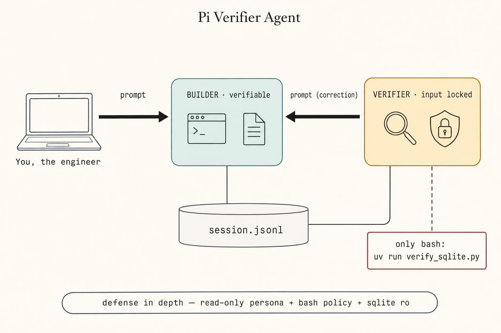
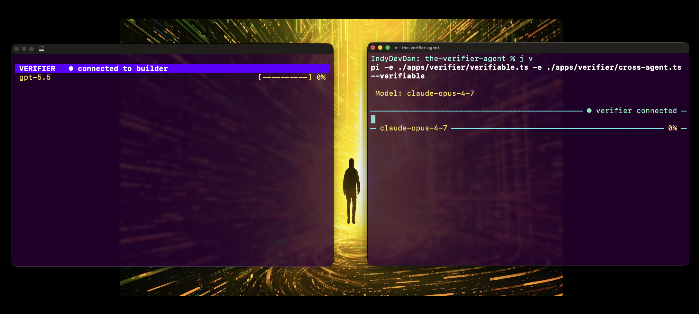

# Pi Verifier Agent

> A two-agent system with a custom pi agent harness that treats verification as a first-class problem, not an additional human-in-the-loop workflow.
>
> Watch the full breakdown: https://youtu.be/EnXKysJNz_8



## How it works

A two-agent observer system for the [Pi Coding Agent](https://pi.dev): a normal interactive **Builder** runs in your terminal; a sibling **Verifier** Pi runs in its own tmux window with input disabled. After every builder turn, the verifier independently re-runs the work using deterministic read-only tools and prompts the builder back with concrete corrective feedback when verification fails. It closes the review-constraint feedback loop so you can stop hand-checking every "✅ done."

The pattern is a **top-down observer**: the builder doesn't know the verifier exists. The verifier connects over a unix domain socket, listens for the builder's lifecycle ticks (`start` / `stop` / `error`), and pulls the slice it needs from the builder's session JSONL on disk. When verification fails, the verifier calls its `verifier_prompt` tool — the only thing it can do that touches the builder — and the builder injects the message via `pi.sendUserMessage(deliverAs:"followUp")` and runs another turn. The loop repeats up to three times, then escalates to the human.

## Quick start

### Agentic Installation

Open Claude Code (or any coding agent you like) in this repo:

```bash
/install              # one-time — open Claude Code in this repo and run it
```

Then run:

```bash
just v                # boot the generic verifier
```

### Manual Installation

No Claude Code? See [Manual install (no agentic coding tool)](#manual-install-no-agentic-coding-tool) below.

### What you'll see on Startup



1. The builder Pi opens in your current terminal. The default footer is hidden; instead, the **input box's borders carry the live status**:
   - Top-right border: `● verifier connected` (or `◌ spawning`, `✗ disconnected`, `⚠ error`)
   - Bottom-left border: active model id (e.g. `claude-sonnet-4-6`)
   - Bottom-right border: context-window utilization (e.g. `12%`)
2. **A new OS-level terminal window opens automatically when Pi is running on your local desktop.** If you're already inside `$TMUX`, you get a sibling tmux window instead. If you're SSH'd into a remote server, the launcher runs on the remote host — it cannot open Terminal.app/Ghostty on your MacBook. In that setup, switch to the sibling tmux window (`prefix+n`, `prefix+w`, or `tmux select-window -t verifier-<session-id>`) or attach from another SSH tab.
3. The verifier window comes pre-tuned: **mouse scroll enabled**, **bottom green tmux status bar hidden**, **10k-line scrollback**, **OSC52 clipboard** (mouse-drag → Cmd+V works natively). Tmux defaults are session-scoped — your other tmux sessions are untouched.
4. The verifier's input row is replaced by a colored full-width status bar — input is locked. The bar shows `VERIFIER · <phase> · <CONFIDENCE>` and updates live (e.g. `VERIFIER · ✓ verified · PERFECT`). The bar's **background color reflects the confidence grade**: green for PERFECT/VERIFIED, orange for PARTIAL/FEEDBACK, red for FAILED, purple while idle/verifying.
5. Type a normal builder prompt. After the builder finishes its turn, the verifier auto-runs verification.
6. If verification fails, the verifier calls `verifier_prompt` with concrete corrective feedback. The builder receives it as a follow-up user message (via `pi.sendUserMessage(deliverAs:"followUp")`) and runs another turn fixing the issue.
7. Loop repeats up to `max_loops: 3` (configurable per persona). On the 4th attempt, the builder surfaces an "escalating to human" message instead of auto-injecting another correction.
8. On `Ctrl+D` of the builder, the verifier window closes, the unix socket is unlinked, and the breadcrumb at `.pi/state/verifier-<sid>.sock.ref` is cleaned up. (`just clean` also force-tears-down anything stale from a prior crash.)

## What this unlocks

### Spend tokens to save time

Engineers spend roughly half their day reviewing agent output. Every "I created the table," "I added the foreign key," "I applied the migration" gets re-checked by hand. That review work is the binding constraint on agentic engineering throughput. The verifier moves it onto a second agent.

If you optimize for tokens, this looks wasteful — you're spending 2–5× more compute. If you optimize for *time*, it's the highest-leverage trade you can make. Tokens are cheap. Your time is not. Spend tokens to generate value and time.

### Break the review constraint

Agentic engineering has two binding constraints: **how much you can plan**, and **how much you can review**. Most engineers stall on review. The verifier collapses that side of the constraint into a parallel agent whose entire job is re-checking, deterministically, with read-only tools.

The verifier's job is **decomposition**: break every claim into the smallest atomic unit that can be independently proven or disproven, then verify each against actual state. A single `PASS` that hides three unverified sub-claims is worse than three explicit `FAIL`s.

### Templated engineering as a habit

The verifier is structurally **un-promptable**. Its input bar is locked; you cannot drop one-off instructions into it. The only thing that drives it is `verify_on_stop.md` rendered against the builder's `stop` event.

That sounds annoying. It's the point.

You can't fix bugs by typing at the verifier — you fix them by editing the persona, the script, or the prompt template. Improvements solve the entire problem class, not the one instance you happened to hit. Every gap turns into reusable engineering. There's no falling back to vibe-coding the fix.

### Trust + Scale, with a positive feedback loop

The verifier compounds. Every `## Report` block lists what it **could not verify** — missing oracles, no fixture, no harness, ambiguous claim. That gap becomes the next thing you template into the persona or build a domain script around. The verifier teaches you what your verifier is missing.

This is how you build the system that builds the system.

### Multi-agent orchestration > a smarter single model

Every model benchmark you see runs a single model in isolation. That's not how the highest-leverage engineers operate. They stack intelligence. They orchestrate models. **GPT 5.5 *and* Opus 4.7**, not *or*. The verifier is the simplest concrete instance of multi-agent orchestration: two specialized agents — one builds, one verifies — coordinated through a tight architectural seam (a unix socket and a session JSONL).

### Defense-in-depth on the bash tool

The bash tool is the most dangerous tool you give an agent. The verifier persona declares its tool surface as `read, grep, find, ls, bash, verifier_prompt` — no `write`, no `edit` — and the persona body restricts bash to read-only commands. Domain-specific personas (sql, python, image-gen) can pin bash to a single allowlisted script: that's the highest level of control you can give an agent. Anything outside the script is blocked.

## Architecture

```
   ┌──────────────────────────────┐         ┌──────────────────────────────┐
   │  Your Terminal               │         │  New OS Window  (or sibling  │
   │  (Ghostty / iTerm / ...)     │         │   tmux window if in $TMUX)   │
   │                              │         │                              │
   │  ┌────────────────────────┐  │         │  ┌────────────────────────┐  │
   │  │  pi  (BUILDER)         │  │         │  │  pi  (VERIFIER --child)│  │
   │  │  verifiable.ts         │◄─┼─unix────┼─►│  verifier.ts           │  │
   │  │  + socket server       │  │ socket  │  │  + status-bar editor   │  │
   │  │  + lifecycle forwarder │  │ JSONL   │  │  + input lock          │  │
   │  └─────────┬──────────────┘  │         │  │  + verifier_prompt tool│  │
   │            │                 │         │  └─────────┬──────────────┘  │
   └────────────┼─────────────────┘         └────────────┼─────────────────┘
                │                                        │
                │ writes session JSONL                   │ reads
                ▼                                        ▼
        ~/.pi/agent/sessions/<sid>.jsonl  ──────────────►   (builder transcript)
```

One Pi binary, two roles. The builder owns a unix domain socket at `/tmp/pi-verifier/<sessionId>.sock` (short path so we sidestep macOS's 104-byte `sun_path` limit, `chmod 0700` so only the owning UID can connect — that is the authentication). The builder pushes lifecycle ticks only — never transcript content. The verifier pulls the substantive content it needs from the builder's session JSONL on disk and runs verification with read-only tools.

### Direction matrix

```
verifier ──► builder           builder ──► verifier
─────────────────────          ──────────────────────
hello                          hello_ack            ← handshake
prompt   (correction text)     prompt_ack           ← receipt confirmation
report   (rendered inline)     event                ← lifecycle channel

Bidirectional: ping / pong (10s liveness), bye (clean teardown).
```

All envelopes are TypeScript discriminated unions on `type`, JSONL-framed (one JSON object per line, terminated by `\n` — split on `\n` only, never via Node's `readline` which would split on `U+2028` / `U+2029` embedded in JSON strings).

### The CONFIDENCE ladder

The verifier emits a `CONFIDENCE:` line under `STATUS:` on every Report. The grade encodes both completeness AND outcome:

| Level | Meaning | Bar color |
|---|---|---|
| `PERFECT` | Every claim verified, zero gaps, no feedback | 🟢 green |
| `VERIFIED` | All checked passed, minor non-blocking gaps | 🟢 green |
| `PARTIAL` | No failures, but significant unverifiable gaps | 🟠 orange |
| `FEEDBACK` | At least one claim failed, `verifier_prompt` called (system working as designed) | 🟠 orange |
| `FAILED` | Couldn't verify at all — escalating to human | 🔴 red |

## Manual install (no agentic coding tool)

### Prerequisites

- **Node 20+** and `npm`
- **tmux** — `brew install tmux` on macOS, `apt install tmux` on Debian/Ubuntu
- **Pi Coding Agent** (`pi` on your PATH), authenticated against an LLM provider
- **just** (recommended) — `brew install just`
- macOS or Linux. Windows-native is untested — use WSL.

### Setup

```bash
git clone <your-fork-or-this-repo>
cd the-verifier-agent
cd apps/verifier && npm install && cd ../..
```

### `.env`

Both the builder and the verifier load `.env` from your **current working directory** on `session_start`. Drop your provider API keys (`ANTHROPIC_API_KEY`, `OPENAI_API_KEY`, `DEEPSEEK_API_KEY`, …) into a project-local `.env` and **both agents see them automatically** — no shell-config gymnastics. Existing `process.env` always wins; `.env` only fills gaps.

### Recipes

```bash
just                  # list all recipes
just verifier         # builder + auto-spawn verifier
just clean            # kill stale verifier-* tmux sessions, sockets, breadcrumbs
just prime            # prime context in an interactive Claude Code session
```

## Known limitations

- **One verifier per builder** (server-side enforced — a duplicate connection gets `bye {reason: "duplicate connection"}`).
- **Late-attach across processes is not supported.** Use `/verify` from the same builder Pi to spawn its own verifier.
- **Persona selection** via `--verifier-agent <name>`. Defaults to the generic `verifier`. Drop a sibling persona file in `.pi/verifier/agents/` and select it without editing source.
- **The verifier's persona body is rendered into `--system-prompt` as a full overwrite.** Pi's default system prompt is replaced, not appended to — by design.
- **Read-only is by tool surface, not by sandbox.** Don't load untrusted personas.
- **Windows-native is untested.** Use WSL.

## Master Agentic Coding

> Prepare for the future of software engineering

Learn tactical agentic coding patterns with [Tactical Agentic Coding](https://agenticengineer.com/tactical-agentic-coding?y=verifier) — the course teaches you to build systems that build the system: own your agent harness, control the core four (context, model, prompt, tools), lock down bash, and orchestrate specialized agents that outperform any single model alone.

Follow the [IndyDevDan YouTube channel](https://www.youtube.com/@indydevdan) to keep your agentic coding advantage compounding.

## License

MIT — see [LICENSE](./LICENSE).
